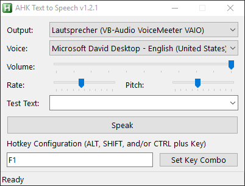
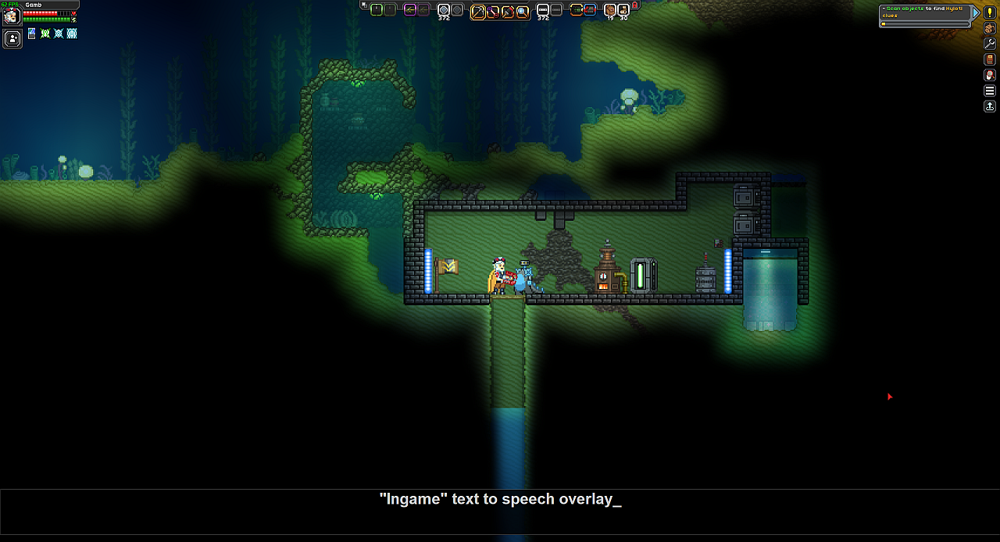

Autohotkey Text-To-Speech
===

It's a fairly simple application hacked together in a couple hours, most of which is from [this repository](https://github.com/altbdoor/ahk-tts).
You'll need to use a virtual audio cable application such as VoiceMeeter to utilize this in Discord/games/whatever.

Main point of this application is the ability to bring up an overlay in (borderless windowed) games to use TTS without having to alt+tab out.

### Usage
1. Make sure you've got your virtual audio cable application of choice running and working
2. Run main.ahk
3. Adjust the output device in the GUI
4. Define a hotkey via the bottom field
5. Insult your friends over Voicechat

### Why?

I know someone unable to speak; That person previously was using an application called "Giggletype", which doesn't support any kind of hotkey magic, requiring you to constantly alt+tab over to it to use TTS.
Not very useful from a usability standpoint when you just want to trashtalk in voice while playing games now, is it?

So I felt like being useful for once and made this.